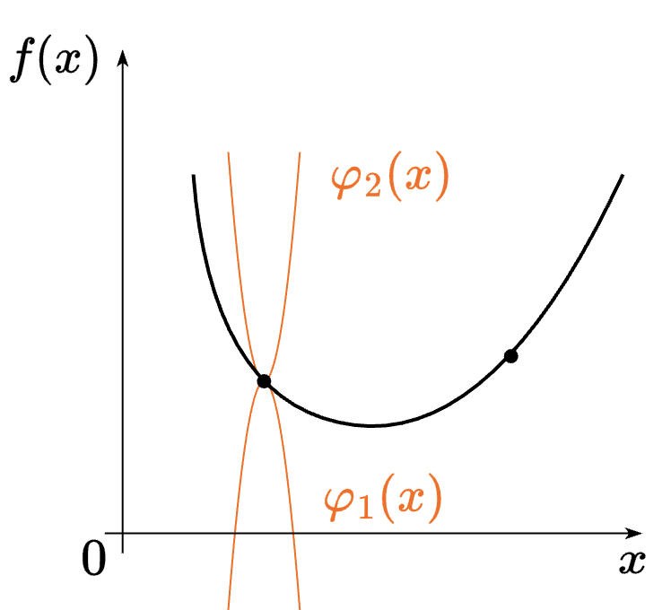

### Определения и формулировки
#### 1-13.

##### 1) Показать, что направление антиградиента - направление наискорейшего локального убывания функции.

Пусть $f$ дифференцируема, зададим искомое направление локального убывания - $h$ - $\Vert h \Vert = 1$.
Тогда её апроксимация: $f(x + \alpha h) = f(x) + \alpha \langle \nabla f(x), h \rangle + o(\alpha)$
$f(x + \alpha h) < f(x) \Rightarrow \alpha  \langle \nabla f(x), h \rangle + o(\alpha) < 0$;
При $\alpha \rightarrow +0$ получаем: $\alpha \langle \nabla f(x), h \rangle \leq 0$

$\vert \langle \nabla f(x), h \rangle \vert \leq \Vert \nabla f(x) \Vert \Vert h \Vert \leq \Vert \nabla f(x) \Vert$

$\langle \nabla f(x), h \rangle \geq -\Vert \nabla f(x) \Vert \Rightarrow h = \dfrac{-\nabla f(x)}{\Vert \nabla f(x) \Vert}$, ч.т.д.

##### 2)  Метод градиентного спуска.

Решаем задачу минимизации 

$$
f(x) \to \min_{x \in \mathbb{R}^d}
$$

Если $f$ дифференцируема, то тогда для решения этой задачи можно использовать метод градиентного спуска:

$x_{k + 1} = x_k - \alpha \nabla f(x_k)$ - одна итерация метода.

##### 3)  Наискорейший спуск.

Решаем задачу минимизации 

$$
f(x) \to \min_{x \in \mathbb{R}^d}
$$

Если $f$ дифференцируема, то тогда для решения этой задачи можно использовать метод наискорейшего спуска:

$x_{k + 1} = x_k - \alpha_k \nabla f(x_k)$ - одна итерация метода, где

$\alpha_k = \arg\min\limits_{\alpha \in \mathbb{R}^+} f(x_k - \alpha \nabla f(x_k))$, т.е. выбираем наилучший шаг спуска на каждой итерации метода.

##### 4) Липшицева парабола для гладкой функции.

Если $f: \mathbb{R}^n \rightarrow \mathbb{R}$ - непрерывно дифференцируема и градиент Липшицев с константой $L$, то $\forall x, y \in \mathbb{R}^n$:

$\vert f(y) - f(x) - \langle \nabla f(x), y - x \rangle \vert \leq \dfrac{L}{2}\Vert y - x \Vert^2$

Если зафиксируем $x_0 \in \mathbb{R}^n$, то:

$\phi_1(x) = f(x_0) + \langle f(x_0), x - x_0 \rangle - \dfrac{L}{2}\Vert x - x_0 \Vert^2$

$\phi_2(x) = f(x_0) + \langle f(x_0), x - x_0 \rangle + \dfrac{L}{2}\Vert x - x_0 \Vert^2$

Это две параболы, и для них верно, что $\phi_1(x) \leq f(x) \leq \phi_2(x)$ $\forall x$

##### 5) Размер шага наискорейшего спуска для квадратичной функции.

Решаем задачу минимизации методом наискорейшего спуска

$$
f(x) = \dfrac{1}{2}x^TAx - b^Tx + с \to \min_{x \in \mathbb{R}^d}
$$

$\nabla f = \dfrac{1}{2}(A + A^T)x - b$

Из условия $\nabla f(x_{k + 1})^T \nabla f(x_k) = 0$ получаем:

$\alpha_k = \dfrac{2 \nabla f(x_k)^T \nabla f(x_k)}{\nabla f(x_k)^T (A + A^T) \nabla f(x_k)}$

##### 6) Характер сходимости градиентного спуска к локальному экстремуму для гладких невыпуклых функций в терминах \(\mathcal{O}\) от числа итераций метода.

$\|\nabla f(x_k)\|^2 \approx \mathcal{O} \left( \dfrac{1}{k} \right)$

##### 7) Характер сходимости градиентного спуска для гладких выпуклых функций в терминах \(\mathcal{O}\) от числа итераций метода.

$f(x_k) - f^* \approx  \mathcal{O} \left( \dfrac{1}{k} \right)$

##### 8) Характер сходимости градиентного спуска для гладких и сильно выпуклых функций в терминах \(\mathcal{O}\) от числа итераций метода.

$\|x_k - x^*\|^2 \approx \mathcal{O} \left( \left(1 - \dfrac{\mu}{L}\right)^k \right)$

$\mu$ - константа сильной выпуклости

$L$ - константа гладкости

##### 9) Связь спектра гессиана с константами сильной выпуклости и гладкости функции.

$\mu = \lambda_{min}(\nabla^2 f(x))$, $L = \lambda_{max}(\nabla^2 f(x))$ $\forall x$.

##### 10) Условие Поляка-Лоясиевича (градиентного доминирования) для функций.

$\exists \mu > 0$:

$\Vert \nabla f(x) \Vert^2 \geq 2\mu(f(x) - f^*)$ $\forall x$

$f^*$ - минмимум функции $f$

##### 11) Сходимость градиентного спуска для сильно выпуклых квадратичных функций. Оптимальные гиперпараметры.

Решаем задачу минимизации методом градиентного спуска

$$
f(x) = \dfrac{1}{2}x^TAx - b^Tx + с \to \min_{x \in \mathbb{R}^d}
$$

Пусть $A \succeq 0 \Rightarrow \nabla f = Ax - b$

$x_{k + 1} = x_k - \alpha (Ax_k - b)$

$\alpha_{opt} = \dfrac{2}{\mu + L}$, где $\mu = \lambda_{min}, L = \lambda_{max}$

$\kappa = \dfrac{L}{\mu} \geq 1$, $\rho = \dfrac{\kappa - 1}{\kappa + 1}$

$\Vert x_k - x^* \Vert \leq \rho^k \Vert x_0 - x^* \Vert$

##### 12) Связь PL-функций и сильно выпуклых функций.

Если функция $f$ $\mu$ сильно выпуклая и дифференицруемая - то она $PL$.

Обратное неверно - $x^2 + 3\sin(x)^2$ - $PL$, но не сильно выпуклая (она вообще не выпуклая).

##### 13) Привести пример выпуклой, но не сильно выпуклой задачи линейных наименьших квадратов (возможно, с регуляризацией).

Задача минимизации при прямоугольной матрице $X \in Mat(m, n)$, $m < n$ (матрица "лежачая")
$$
\Vert X \Theta - y \Vert^2 \to \min_{x \in \mathbb{R}^d}
$$